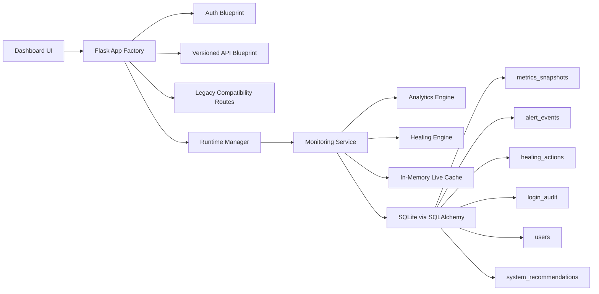

# AutoOps AI - Production-Ready Self-Healing Infrastructure Monitor

AutoOps AI is a polished AIOps platform built with Flask, SQLite, psutil, SQLAlchemy, and a premium observability dashboard. It keeps the original local-first simplicity, but upgrades the project into a resume-ready platform that demonstrates backend architecture, SRE thinking, security engineering, analytics design, and careful self-healing automation.

## Why this project matters

This project shows how to evolve a simple monitoring dashboard into an explainable operations platform:

- Rich host telemetry with anomaly detection and lightweight forecasting
- Guarded self-healing with policy files, cooldowns, dry-run mode, and confirmation gates
- Secure Flask architecture with application factory, SQLAlchemy ORM, Flask-Login, CSRF protection, and audit logging
- Versioned APIs plus compatibility wrappers for legacy routes
- Modern dashboard UX that feels closer to a commercial observability product than a classroom demo

## Feature highlights

- Application factory pattern with modular package layout
- SQLite for local development with SQLAlchemy models and Flask-Migrate support
- Background sampler thread with in-memory cache plus periodic DB persistence
- Metrics for CPU, memory, disk, swap, network I/O, disk I/O, load average, uptime, process count, and API latency
- Rule-based analytics with alert deduplication, severity scoring, trend detection, forecasting, and explainable recommendations
- Optional ML mode via Isolation Forest when `scikit-learn` is available
- Policy-based healing engine for process kill, temp cleanup, manual recommendation, and webhook-ready automation
- Secure auth with password hashing, login throttling, session protection, account lockout, and login audit records
- Versioned APIs under `/api/v1/*` with legacy compatibility for `/stats`, `/history`, `/processes`, and `/logs`
- Responsive dashboard with health score, anomaly badges, alert timeline, healing history, process filtering, and log controls

## Architecture



## Local setup

```powershell
python -m venv .venv
.venv\Scripts\Activate.ps1
pip install -r requirements.txt
copy .env.example .env
python app.py
```

Open `http://127.0.0.1:5000`.

Default dev credentials:

- Username: `admin`
- Password: `admin123!`

## Database and migrations

This MVP auto-creates tables on startup for frictionless local development. For formal schema evolution:

```bash
flask --app app db init
flask --app app db migrate -m "initial autoops schema"
flask --app app db upgrade
```

## Testing

```bash
pytest
ruff check .
black --check .
```

## Docker

```bash
docker compose up --build
```

## Security notes

- Passwords are hashed securely
- Login attempts are rate-limited and audited
- Account lockout kicks in after repeated failures
- CSRF protection is enabled for forms
- Security headers are applied globally
- Dangerous healing actions can require operator confirmation
- Healing defaults to dry-run to avoid accidental destructive behavior

## Resume-ready bullets

- Designed and implemented a modular Flask-based AIOps platform with versioned APIs, SQLAlchemy persistence, secure auth, and policy-driven remediation
- Built explainable anomaly detection and forecasting workflows with rule-based fallbacks and optional Isolation Forest analytics
- Shipped a premium observability dashboard with correlated alerts, self-healing audit trails, structured logs, and health scoring
- Added deployment-ready Docker, Gunicorn, testing, linting, and migration support while preserving backward-compatible APIs
