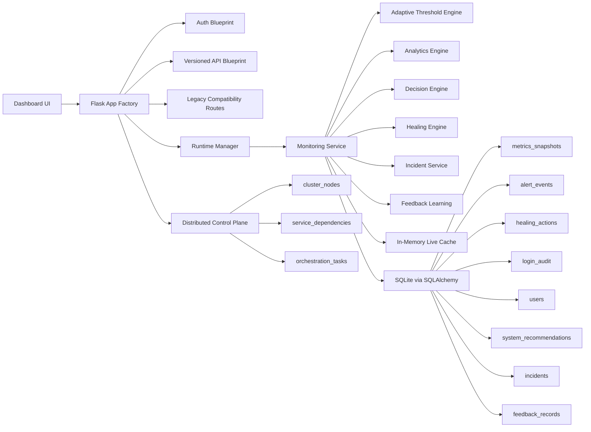

# AutoOps AI - Production-Ready Self-Healing Infrastructure Monitor

Live Demo: https://autoops-ai-92w3.onrender.com/

AutoOps AI is a polished AIOps platform built with Flask, SQLite, psutil, SQLAlchemy, and a premium observability dashboard. It keeps the original local-first simplicity, but upgrades the project into a resume-ready platform that demonstrates backend architecture, SRE thinking, security engineering, analytics design, and careful self-healing automation.

For Render deploys, pin Python with the repo-root `.python-version` file or set `PYTHON_VERSION=3.12.8` in the service environment. This app is currently validated against Python 3.12 for best dependency compatibility.

## Why this project matters

This project shows how to evolve a simple monitoring dashboard into an explainable operations platform:

- Rich host telemetry with anomaly detection and lightweight forecasting
- Guarded self-healing with policy files, cooldowns, dry-run mode, and confirmation gates
- Secure Flask architecture with application factory, SQLAlchemy ORM, Flask-Login, CSRF protection, and audit logging
- Versioned APIs plus compatibility wrappers for legacy routes
- Modern dashboard UX that feels closer to a commercial observability product than a classroom demo

## Feature highlights

- Application factory pattern with modular package layout
- SQLite for local development with SQLAlchemy models and Flask-Migrate support
- Background sampler thread with in-memory cache plus periodic DB persistence
- Metrics for CPU, memory, disk, swap, network I/O, disk I/O, load average, uptime, process count, and API latency
- Rule-based analytics with alert deduplication, severity scoring, trend detection, forecasting, and explainable recommendations
- Optional ML mode via Isolation Forest when `scikit-learn` is available
- Policy-based healing engine for process kill, temp cleanup, manual recommendation, and webhook-ready automation
- Secure auth with password hashing, login throttling, session protection, account lockout, and login audit records
- Versioned APIs under `/api/v1/*` with legacy compatibility for `/stats`, `/history`, `/processes`, and `/logs`
- Responsive dashboard with health score, anomaly badges, alert timeline, healing history, process filtering, logs intelligence, and AI command-center workflows
- Distributed MVP foundation with cluster node registry, heartbeat APIs, dependency graph seeding, and simulated orchestration tasks

## Architecture



## Distributed MVP foundation

AutoOps AI is still intentionally local-first, but the repo now includes the first real control-plane building blocks for a distributed follow-on MVP:

- cluster node registry with heartbeat tracking
- seeded service dependency map for topology visualization
- simulated orchestration task queue for cluster-wide actions
- tenant and cluster identifiers in the data model
- control-plane APIs that let this project evolve into an agent + control-plane architecture

Current distributed-ready endpoints:

- `GET /api/v1/cluster/overview`
- `GET /api/v1/cluster/nodes`
- `POST /api/v1/cluster/nodes/heartbeat`
- `GET /api/v1/cluster/dependencies`
- `GET /api/v1/cluster/tasks`
- `POST /api/v1/cluster/tasks`

This keeps the current MVP understandable while clearly preparing for:

- agent-based collection across multiple nodes
- cluster-wide orchestration
- dependency-aware remediation
- streaming backends like NATS, Redis Streams, or Kafka
- distributed metric/event storage
- tenant-aware RBAC for multi-tenant environments

## Local setup

```powershell
python -m venv .venv
.venv\Scripts\Activate.ps1
pip install -r requirements.txt
pip install -r requirements-ml.txt
copy .env.example .env
python app.py
```

Open `http://127.0.0.1:5000`.

Dev-only seeded credentials are available only when `AUTOOPS_SEED_DEFAULT_ADMIN=true` in development/testing.

- Username: `admin`
- Password: `admin123!`

Production should set:

- `AUTOOPS_SECRET_KEY`
- `AUTOOPS_DEFAULT_ADMIN_PASSWORD` only if you explicitly want to seed an admin
- `AUTOOPS_SEED_DEFAULT_ADMIN=false`

If you skip `requirements-ml.txt`, AutoOps AI will still run and automatically fall back to rule-based analytics.

## Distributed control-plane MVP local run

The new distributed MVP can now run locally without Docker by default:

- control-plane metadata uses SQLite at `./.autoops-control-plane.db`
- stream transport uses a SQLite-backed local stream bus at `./.autoops-streams.db`

Run it with:

```powershell
.venv\Scripts\Activate.ps1
copy .env.example .env
py -m control_plane.scripts.bootstrap_demo
uvicorn control_plane.app.main:app --reload --port 8000
```

In a second terminal:

```powershell
$env:AUTOOPS_WORKER_RUN_ONCE="1"
py -m control_plane.app.workers.telemetry_ingest
```

In a third terminal:

```powershell
$env:AUTOOPS_AGENT_RUN_ONCE="1"
py -m agent.autoops_agent.main
```

For a continuous demo, omit the `*_RUN_ONCE` environment variables.

To preview the distributed foundation locally, optionally enable:

```powershell
$env:AUTOOPS_DISTRIBUTED_MODE="true"
$env:AUTOOPS_CLUSTER_NAME="demo-cluster"
$env:AUTOOPS_NODE_ID="control-plane-1"
$env:AUTOOPS_NODE_ROLE="control-plane"
python app.py
```

## Database and migrations

This MVP auto-creates tables on startup for frictionless local development. For formal schema evolution:

```bash
flask --app app db init
flask --app app db migrate -m "initial autoops schema"
flask --app app db upgrade
```

## Testing

```bash
pytest
ruff check .
black --check .
```

## Docker

```bash
docker compose up --build
```

## Security notes

- Passwords are hashed securely
- Login attempts are rate-limited and audited
- Account lockout kicks in after repeated failures
- CSRF protection is enabled for forms
- Security headers are applied globally
- Dangerous healing actions can require operator confirmation
- Healing defaults to dry-run to avoid accidental destructive behavior

## Resume-ready bullets

- Designed and implemented a modular Flask-based AIOps platform with versioned APIs, SQLAlchemy persistence, secure auth, and policy-driven remediation
- Built explainable anomaly detection, adaptive thresholds, forecasting, incident grouping, and feedback-driven decision workflows
- Shipped a premium observability dashboard with correlated alerts, AI command center panels, self-healing audit trails, and validation views
- Added deployment-ready Docker, Gunicorn, testing, linting, and migration support while preserving backward-compatible APIs
